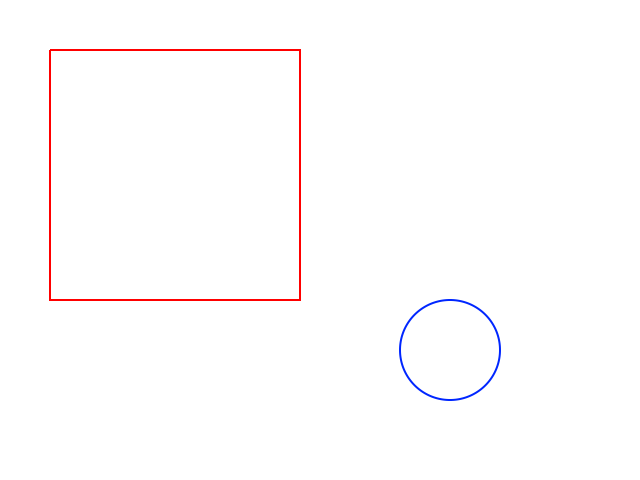
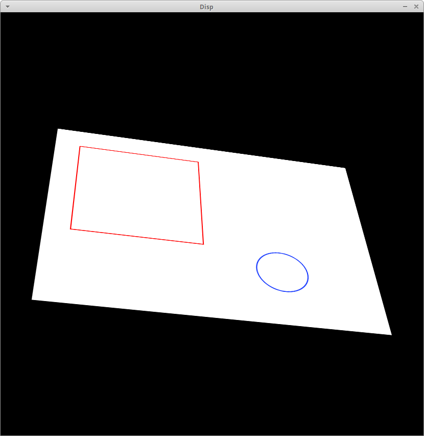

# About

Perform the following operations on an image in opencv:
* Pitch
* Yaw
* Roll
* X Offset
* Y Offset
* X Scale
* Y Scale

Code from here:

https://stackoverflow.com/questions/17087446/how-to-calculate-perspective-transform-for-opencv-from-rotation-angles

Input Image:

Example:

